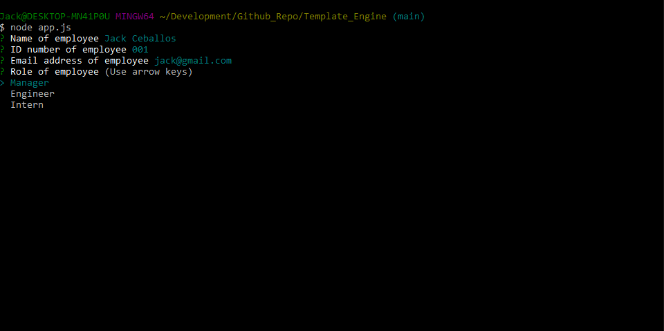
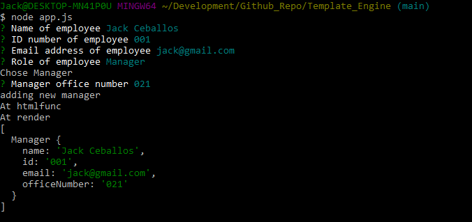
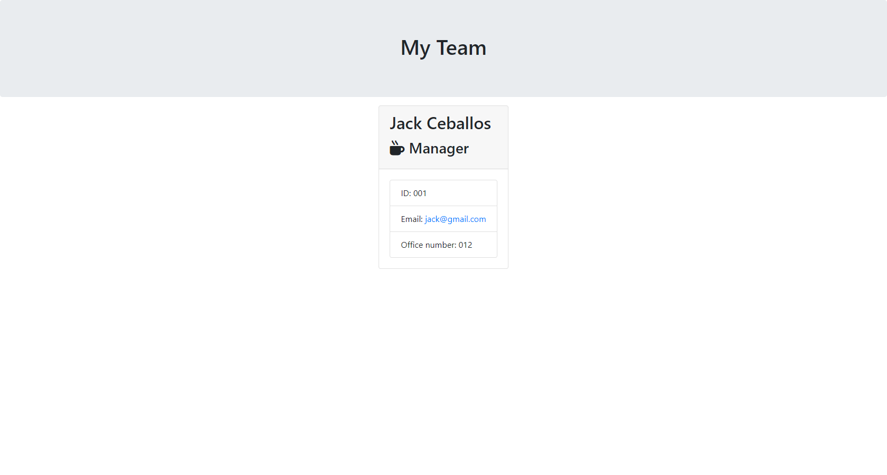
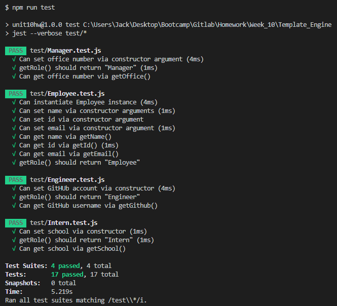

# Template_Engine

## Table of contents

- [Overview](#overview)
  - [Description](#description)
  - [Screenshot](#screenshot)
- [My process](#my-process)
  - [Built with](#built-with)
  - [What I learned](#what-i-learned)
- [Author](#author)

## Overview

### Description

A Command Line Input Application that uses JavaScript ES6 Classes and Node.js to render an html page with an employee's information. 

The application can be started by using the command: `node app.js`. Then the user will be asked questions about the employee they wish to display. Once all the information is entered the `team.html` file will be rendered with the employee's information.

### Screenshot

- Command line input view when inputting information


- Command line once all information has been entered successfully


- The rendered HTML page with the employee's information


- The JavaScript Classes pass all of the tests 


## My process

### Built with

- HTML5
- CSS
- JavaScript
- JavaScript Classes
- Node.js File Path module
- Node.js File Write module
- Inquirer

### What I learned

In this project I learned how to use ES6 Classes to create objects of employees. Each position in the company had its own Class. The Class object once entered through the command line app would then be rendered into a `team.html` file.

The Employee class is the main class:

``` javascript
class Employee {
    constructor(name, id, email) {
        this.name = name;
        this.id = id;
        this.email = email;        
    }
    getName(){
        return this.name;
    }
    getId(){
        return this.id;
    }
    getEmail(){
        return this.email;
    }
    getRole(){
        return "Employee";
    }
}
```

All other specific employee classes are extension :

``` javascript
const Employee = require("./Employee.js");

class Engineer extends Employee {
    constructor(name, id, email, github){
        super(name, id, email);
        this.github = github
    }
    getGithub(){
        return this.github;
    }
    getRole(){
        return "Engineer";
    }
}
```

## Author

- Portfolio - [Jack Ceballos](https://jceb30198.github.io/#/)
- GitHub - [@jceb30198](https://www.frontendmentor.io/profile/jceb30198)
- LinkedIn - [Jack's LinkedIn](https://www.linkedin.com/in/jackceballosmia/)